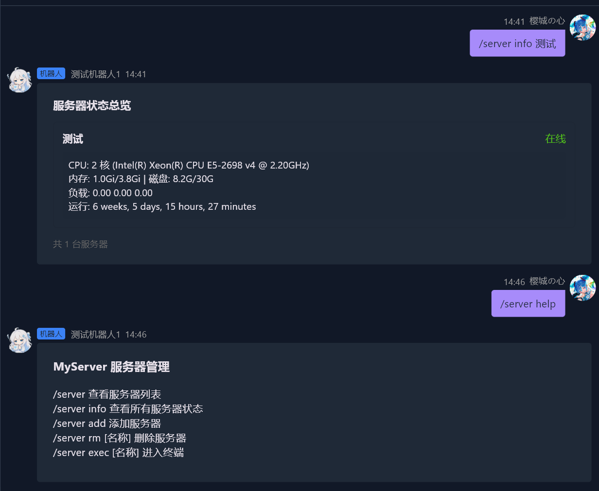
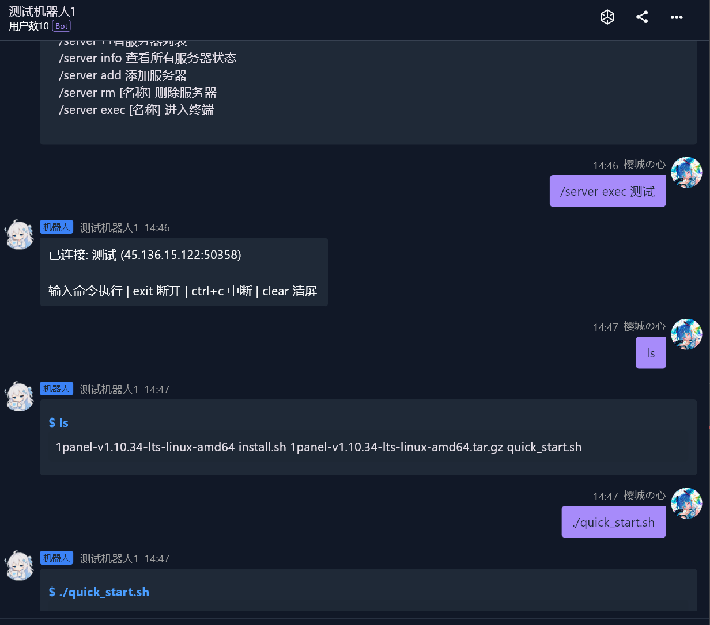
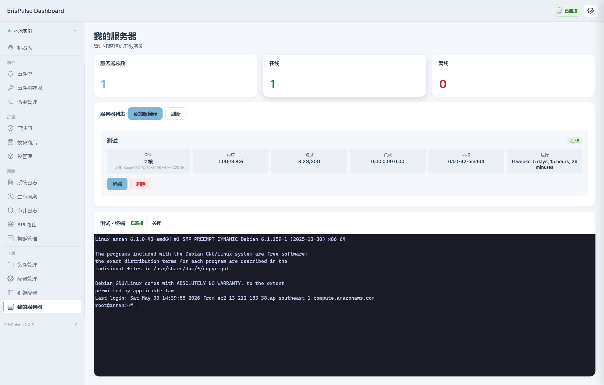

# ErisPulse-MyServer

服务器管理模块 — 支持远程监控、WebSocket 终端、Dashboard 管理

## 截图

<p align="center">
  
  
</p>

## 功能

- **服务器卡片** — 自动显示 CPU、内存、磁盘、负载等信息
- **WebSocket 终端** — 基于 xterm.js，支持颜色、光标闪烁、交互式程序
- **Dashboard 管理** — 添加/删除服务器、查看状态、终端连接
- **多种认证** — 支持密码和私钥登录

## 命令

| 命令 | 说明 |
|------|------|
| `/server` | 查看服务器列表 |
| `/server info` | 查看所有服务器状态 |
| `/server add` | 添加服务器 |
| `/server rm [名称]` | 删除服务器 |
| `/server exec [名称]` | 进入聊天终端 |

## Dashboard

<p align="center">
  
</p>

- 服务器卡片自动显示系统信息
- 添加服务器（支持密码/私钥）
- 删除服务器
- WebSocket 终端

## 配置

```toml
[MyServer]
exec_timeout = 30
admin_users = []
```
